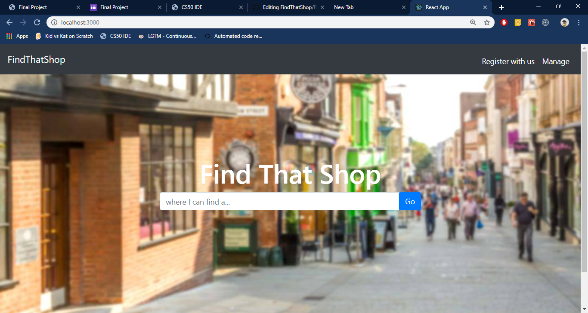
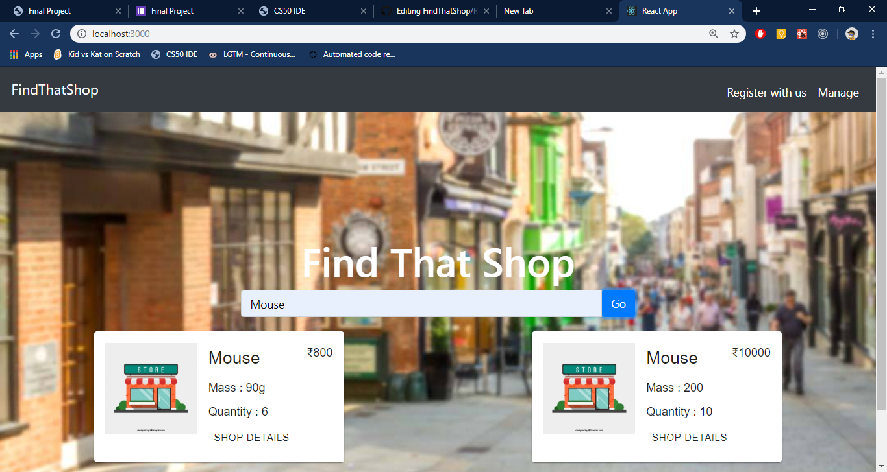
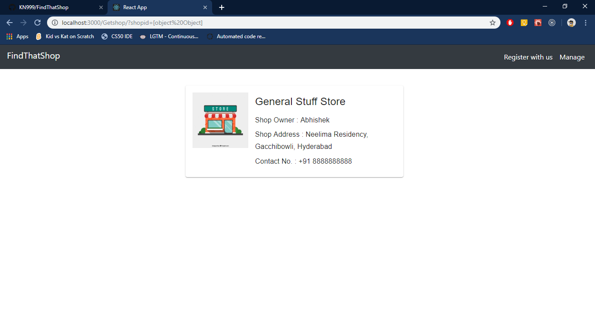
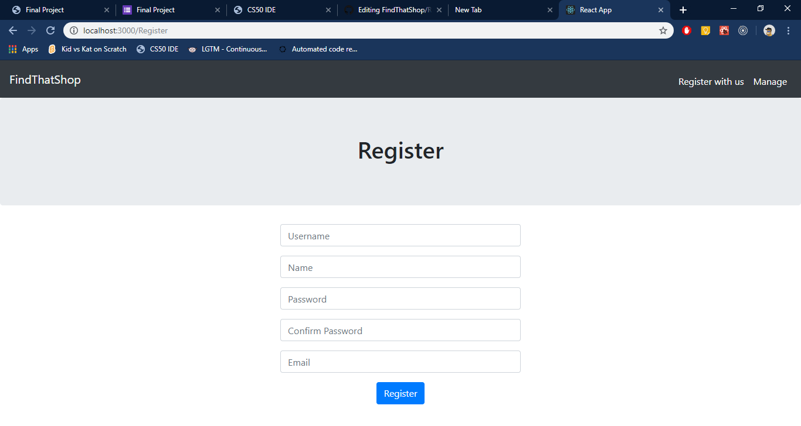
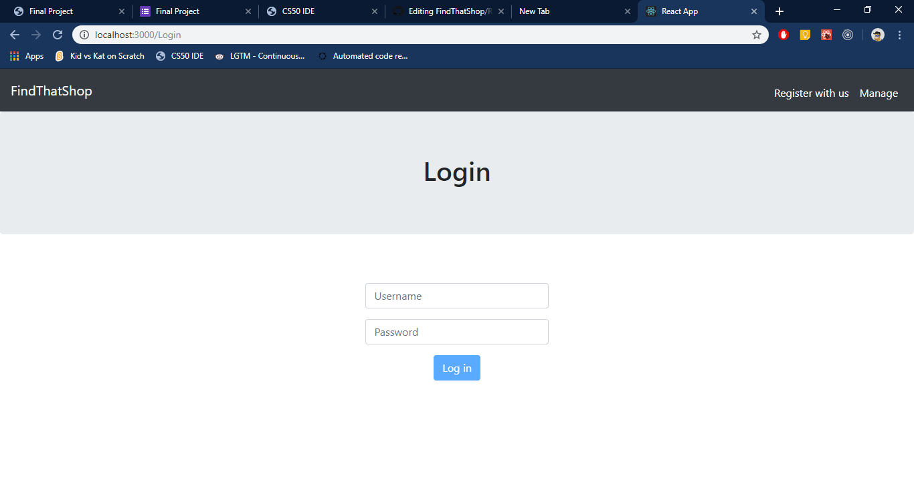
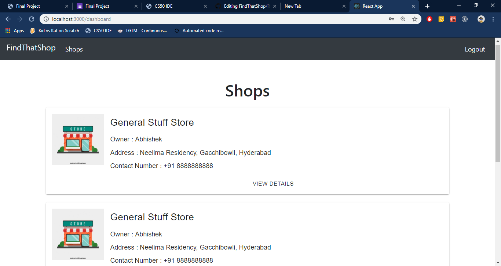
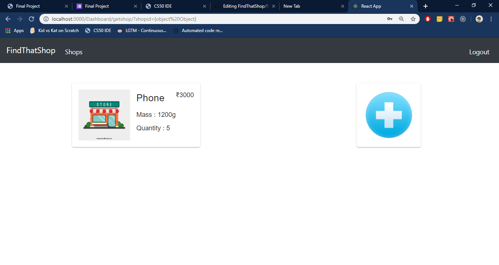

# FindThatShop 
## Do checkout the website - (https://findthatshop.herokuapp.com/)

[](https://app.codacy.com/app/KN999/FindThatShop?utm_source=github.com&utm_medium=referral&utm_content=KN999/FindThatShop&utm_campaign=Badge_Grade_Dashboard)

FindThatShop find the shops that are nearby and give you the list of shops that has the item you searched.<br><br>
There will be two types of people that will use this - 
* Customer
* Shop Owner

Customer can search things that the Shop Owner sell and it's availability. Customer Don't need to register or login to search things.

* Customer View :
<br><br>

<br><br>
Customer can search the item he or she is looking for.
<br><br>

<br><br>
Customer can view details of the shop that has the item like shopname, address, phone no., etc.
<br><br>

<br><br>

Shop Owner needs to Register thier shops in order to let customer view thier details. Shop owner can Manage their Shops easily with this.

* Shop Owner View : <br><br>
Shop Owner can Register themselfs<br><br>

<br><br>
Shop Owner can Login in order to manage shops
<br><br>

<br><br>
They can add shops
<br><br>

<br><br>
 They can add items to a shop
<br><br>

<br><br>

## Getting Started & Installing

In order to use this project on your local machine do the following steps. There are 2 server you need to start App server and Web server.
After cloning the repository.

To run web server(you need to be in FindThatShop folder)
```
npm install
npm run
```

To run app server(you need to be in server folder)
```
cd server
npm install
node app.js
```

### Prerequisites

Before running you need to install the following-
- nodejs
- expressjs
- mongodb

## Built With

* [Nodejs](https://nodejs.org/en/)
* [Reactjs](https://reactjs.org/)
* [Expressjs](https://expressjs.com/)
* [MongoDB](https://www.mongodb.com)
* [MaterialUI](https://material-ui.com)
* [Axios](https://www.npmjs.com/package/axios)
* [FontAwesome](https://fontawesome.com/)
* [Bootstrap](https://getbootstrap.com/)
* [Redux](https://redux.js.org/)
* [Hooks](https://reactjs.org/docs/hooks-intro.html)
<br>etc.

## Contributing

Feel free to contribute :)

## License

This project is licensed under the MIT License - see the [LICENSE.md](LICENSE) file for details
